# Travelopia

[Click here to visit site](https://app.netlify.com/sites/papaya-wisp-9e030b/deploys/6604659266e1ec36cbedce7d/)

## CSS Styles for Travelopia

### Global Styles

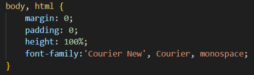

These styles ensure that there is no default margin or padding on the body and HTML elements, the component takes up the full height of the viewport and also applies a font family.

### Container Styles

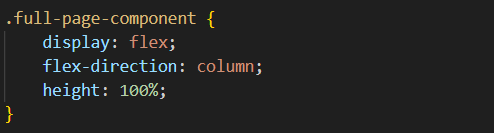

This sets up a flex container with a column layout, and it ensures the container takes at least the full height of the viewport.

### Header Styles

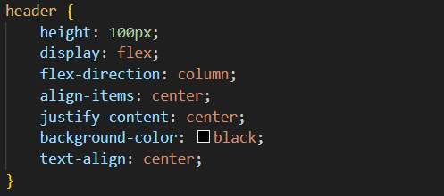

Styles for the header, including a fixed height, centered content and text, and a black background color.

### Header Content Styles

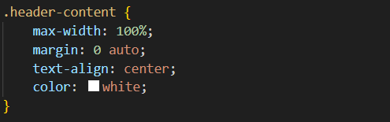

Styles for the content inside the header ensures the content doesn't exceed the width of its container Centers the content horizontally and sets the text color to white.

### Image Container Styles

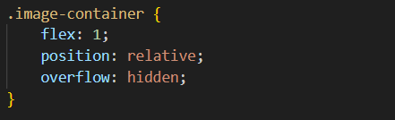

Allows the container to expand to fill remaining space. Establishes a positioning context for absolutely positioned elements and hides any overflow content.

### Image Styles

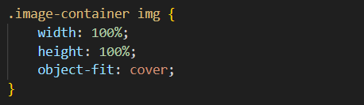

Ensures the image takes up the full width and height of its container while maintaining its aspect ratio.

### Image Overlay Styles

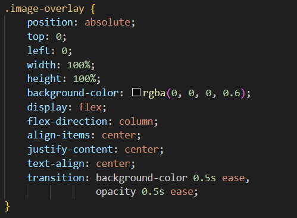

Positions the overlay over the image. Sets a semi-transparent black background color. Centers content both vertically and horizontally and applies a smooth transition effect.

## Overlay Text Styles

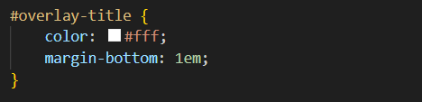

Styles for the overlay title, ensuring white text color, adds bottom margin for spacing.

## Button Styles

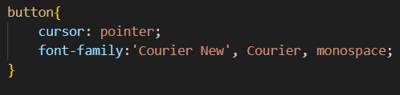
Changes the cursor to pointer on hover and also applies a font family.

### Footer Styles

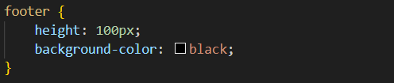

Styles for the footer, with a fixed height and a black background color.

### Footer Content Styles

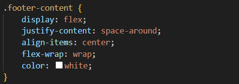

Aligns content horizontally with space around each item. Centers content vertically. Sets the text color to white.

### Alert Popup Styles

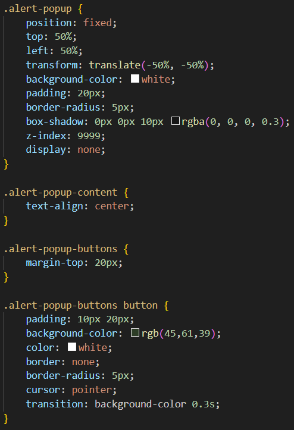

.alert-popup: Styles the container for the popup with fixed positioning at the center of the viewport, a white background, padding, border radius, box shadow, and hidden by default.

.alert-popup-content: Centers the content of the popup.

.alert-popup-buttons: Adds margin above the buttons within the popup.

.alert-popup-buttons button: Styles the buttons with padding, background color, text color, border radius, cursor, and a transition effect for hover.

### Responsive Styles

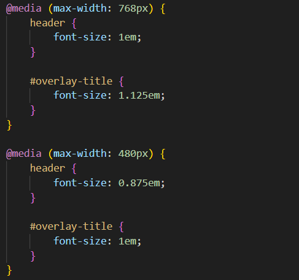

Adjusts font sizes for the header and overlay title on different screen sizes. For 768px and below: Sets the font size of the header to 1em and the overlay title to 1.125em and for 480px and below: Further reduces the font size of the header to 0.875em while keeping the overlay title at 1em.

