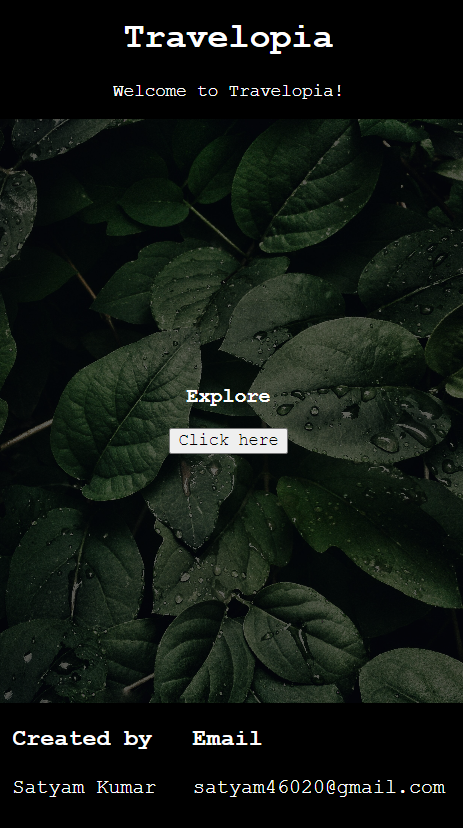
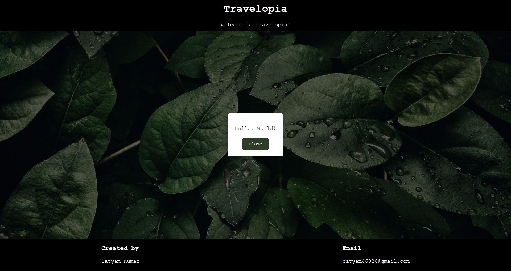

# Travelopia

A streamlined single-page web element that offers an immersive user experience for exploring travel options. With a sleek 100px navbar, a matching footer, captivating image overlays, and a click-triggered alert button, it's designed for responsiveness and ease of use. Built with HTML, CSS, and JavaScript.

[Click here to visit site](https://6604659266e1ec36cbedce7d--papaya-wisp-9e030b.netlify.app/)

## How to Use

To run this project locally:

1. Clone this repository to your local storage.
2. Open the `index.html` file in your preferred web browser.
3. Explore the Travelopia experience right from your device.

### Screenshots

#### Mobile View

#### Desktop View

#### Pop-up Alert

## Features

**Navbar and Footer**: Consistent 100px height for easy navigation and information accessibility.
**Dynamic Design**: Fluid layout adjustments for seamless browsing on different screens.
**Image with Overlay Text**: Enhances visual appeal with translucent text overlay.
**Alert Button**: Instant interaction with clickable alert feature.
**Title and Banner**: Centered elements for clear content focus.

## Tech Stack

**HTML**: Provides structural foundation.
**CSS**: Handles UI styling for appealing presentation.
**JavaScript**: Implements interactive features.

## Design Elements

**Media Queries**:
Ensures responsiveness across various screen sizes.

**Keyframes**:
Creates captivating animations for enhanced user engagement.

**Overlay**:
Improves image readability and focus with translucent layer.

**Responsive Design**:
Adapts layout for optimal viewing on diverse devices.

**Fonts & Icons**:
Enhances typography and visual elements for modern design. 

